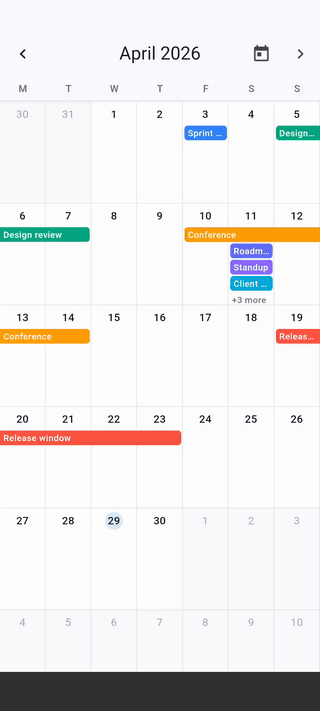

# ops_calendar

A lightweight, performant Flutter month calendar with multi-day event ribbons.

<p align="center">
  
</p>

- **State-management agnostic** — works with BLoC, Riverpod, Provider, GetX, or plain `setState`.
- **Multi-day ribbons** — events spanning multiple days render as continuous bars across week rows, with greedy lane packing for overlapping events.
- **Programmatic control** — `OpsCalendarController` for next/previous/jump-to-month and listening to the visible month from outside the widget.
- **Performant** — `RepaintBoundary` per page, pre-computed ribbon layout, `PageView.builder` recycling, pure-Dart algorithms.
- **JSON-ready models** — `CalendarEvent` and `CalendarConfig` round-trip through JSON via `freezed` + `json_serializable`.
- **Tested** — unit tests for layout algorithms, widget tests for rendering, callbacks, and the controller.

---

## Table of contents

- [Installation](#installation)
- [Quick start](#quick-start)
- [Programmatic control](#programmatic-control)
- [Custom header with chevrons](#custom-header-with-chevrons)
- [Tapping events & dates: popups, sheets, dialogs](#tapping-events--dates-popups-sheets-dialogs)
- [Custom ribbon rendering with `ribbonBuilder`](#custom-ribbon-rendering-with-ribbonbuilder)
- [Migrating from Syncfusion Calendar](#migrating-from-syncfusion-calendar)
- [Data structure & mapping](#data-structure--mapping)
- [State management](#state-management)
  - [BLoC](#with-bloc)
  - [Riverpod](#with-riverpod)
  - [Provider / setState](#with-provider--setstate)
- [Theming](#theming)
- [Configuration](#configuration)
- [Events & JSON](#events--json)
- [API reference](#api-reference)
- [Architecture](#architecture)
- [Performance](#performance)
- [Development](#development)
- [License](#license)

---

## Installation

```yaml
dependencies:
  ops_calendar: ^0.2.0
```

Then:

```bash
flutter pub get
```

Requires Flutter `>= 3.27.0` (uses the modern `Color` API).

---

## Quick start

```dart
import 'package:flutter/material.dart';
import 'package:ops_calendar/ops_calendar.dart';

class MyCalendar extends StatelessWidget {
  const MyCalendar({super.key});

  @override
  Widget build(BuildContext context) {
    return OpsMonthCalendar(
      initialMonth: DateTime(2026, 4),
      events: [
        CalendarEvent(
          id: '1',
          title: 'Conference',
          start: DateTime(2026, 4, 15),
          end: DateTime(2026, 4, 17),
          color: const Color(0xFFF59E0B),
        ),
        CalendarEvent(
          id: '2',
          title: 'Standup',
          start: DateTime(2026, 4, 16),
          end: DateTime(2026, 4, 16),
          color: const Color(0xFF3B82F6),
        ),
      ],
      onEventTap: (e) => debugPrint('Tapped event ${e.title}'),
      onDateTap: (d) => debugPrint('Tapped date $d'),
      onMonthChanged: (m) => debugPrint('Now showing $m'),
    );
  }
}
```

That's it. Swipe left/right between months. Multi-day events render as ribbons. Single-day events as chips.

---

## Programmatic control

Pass an `OpsCalendarController` to drive the calendar from outside — for chevron buttons, "Today" buttons, BLoC listeners, deep links, anything.

```dart
class MyScreen extends StatefulWidget {
  const MyScreen({super.key});
  @override
  State<MyScreen> createState() => _MyScreenState();
}

class _MyScreenState extends State<MyScreen> {
  late final OpsCalendarController _controller;

  @override
  void initState() {
    super.initState();
    _controller = OpsCalendarController();
  }

  @override
  void dispose() {
    _controller.dispose();   // important — same lifecycle as TextEditingController
    super.dispose();
  }

  @override
  Widget build(BuildContext context) {
    return OpsMonthCalendar(
      controller: _controller,
      initialMonth: DateTime.now(),
    );
  }
}
```

### Available methods

| Method | What it does |
|---|---|
| `controller.nextMonth()` | Animate to next month |
| `controller.previousMonth()` | Animate to previous month |
| `controller.goToMonth(DateTime target)` | Animate to a specific month (any year) |
| `controller.jumpToMonth(DateTime target)` | Same, but instant — no animation |
| `controller.goToToday()` | Animate to the month containing today |

Each animated method takes optional `duration` and `curve` parameters:

```dart
controller.goToMonth(
  DateTime(2030, 1),
  duration: const Duration(milliseconds: 500),
  curve: Curves.fastOutSlowIn,
);
```

### Reading the visible month

`OpsCalendarController` is a `ChangeNotifier`. Listen to it to drive a custom header label:

```dart
AnimatedBuilder(
  animation: _controller,
  builder: (_, __) {
    final m = _controller.visibleMonth ?? DateTime.now();
    return Text(_formatMonth(m));
  },
);
```

Or with `addListener`:

```dart
@override
void initState() {
  super.initState();
  _controller = OpsCalendarController()
    ..addListener(() => debugPrint('Visible: ${_controller.visibleMonth}'));
}
```

`visibleMonth` is `null` until the widget builds — handle the null case with a fallback.

---

## Custom header with chevrons

Full working pattern:

```dart
class CalendarPage extends StatefulWidget {
  const CalendarPage({super.key});
  @override
  State<CalendarPage> createState() => _CalendarPageState();
}

class _CalendarPageState extends State<CalendarPage> {
  late final OpsCalendarController _calendar;

  @override
  void initState() {
    super.initState();
    _calendar = OpsCalendarController();
  }

  @override
  void dispose() {
    _calendar.dispose();
    super.dispose();
  }

  @override
  Widget build(BuildContext context) {
    return Scaffold(
      appBar: AppBar(
        leading: IconButton(
          icon: const Icon(Icons.chevron_left),
          onPressed: _calendar.previousMonth,
        ),
        title: AnimatedBuilder(
          animation: _calendar,
          builder: (_, __) {
            final m = _calendar.visibleMonth ?? DateTime.now();
            return Text(_formatMonth(m));
          },
        ),
        centerTitle: true,
        actions: [
          IconButton(
            icon: const Icon(Icons.today),
            tooltip: 'Today',
            onPressed: _calendar.goToToday,
          ),
          IconButton(
            icon: const Icon(Icons.chevron_right),
            onPressed: _calendar.nextMonth,
          ),
        ],
      ),
      body: OpsMonthCalendar(
        controller: _calendar,
        events: const [/* ... */],
      ),
    );
  }

  String _formatMonth(DateTime m) {
    const months = [
      'January','February','March','April','May','June',
      'July','August','September','October','November','December',
    ];
    return '${months[m.month - 1]} ${m.year}';
  }
}
```

Tapping a chevron animates the calendar; the header rebuilds because `AnimatedBuilder` listens to the controller. User swipes also flow through the controller, so the header stays in sync regardless of the input source.

---

## Tapping events & dates: popups, sheets, dialogs

The package deliberately ships **no built-in popup** — you decide what happens when an event ribbon or empty cell is tapped. The two callbacks give you everything:

```dart
OpsMonthCalendar(
  onEventTap: (CalendarEvent e) { /* event was tapped */ },
  onDateTap:  (DateTime d)      { /* empty cell was tapped */ },
);
```

Below are the most common patterns. Pick one (or mix them) based on your UX.

### Pattern 1 — Bottom sheet (recommended on mobile)

Shows from the bottom edge, dismissible by drag. The most "Material" pattern for event detail.

```dart
OpsMonthCalendar(
  onEventTap: (event) {
    showModalBottomSheet<void>(
      context: context,
      showDragHandle: true,
      builder: (ctx) => Padding(
        padding: const EdgeInsets.all(16),
        child: Column(
          mainAxisSize: MainAxisSize.min,
          crossAxisAlignment: CrossAxisAlignment.start,
          children: [
            Text(event.title, style: Theme.of(ctx).textTheme.titleLarge),
            const SizedBox(height: 8),
            Text('${event.start.toLocal()} → ${event.end.toLocal()}'),
            if (event.subtitle != null) ...[
              const SizedBox(height: 8),
              Text(event.subtitle!),
            ],
            const SizedBox(height: 16),
            Row(
              children: [
                FilledButton(
                  onPressed: () => Navigator.pop(ctx),
                  child: const Text('Close'),
                ),
                const SizedBox(width: 8),
                OutlinedButton(
                  onPressed: () { /* edit / delete / ... */ },
                  child: const Text('Edit'),
                ),
              ],
            ),
          ],
        ),
      ),
    );
  },
);
```

### Pattern 2 — Modal dialog

Centered, blocking, good for confirmations or short detail.

```dart
onEventTap: (event) {
  showDialog<void>(
    context: context,
    builder: (ctx) => AlertDialog(
      title: Text(event.title),
      content: Text('${event.start} → ${event.end}'),
      actions: [
        TextButton(onPressed: () => Navigator.pop(ctx), child: const Text('OK')),
      ],
    ),
  );
},
```

### Pattern 3 — Full-screen detail route

Best when the detail view is non-trivial (form, comments, attachments).

```dart
onEventTap: (event) {
  Navigator.of(context).push(
    MaterialPageRoute(builder: (_) => EventDetailScreen(event: event)),
  );
},
```

### Pattern 4 — Anchored menu (Cupertino-ish)

Position a popup menu near the event. Simplest version uses `showMenu`:

```dart
onEventTap: (event) async {
  final box = context.findRenderObject() as RenderBox?;
  final overlay = Overlay.of(context).context.findRenderObject() as RenderBox?;
  if (box == null || overlay == null) return;
  final pos = RelativeRect.fromRect(
    Rect.fromPoints(
      box.localToGlobal(Offset.zero, ancestor: overlay),
      box.localToGlobal(box.size.bottomRight(Offset.zero), ancestor: overlay),
    ),
    Offset.zero & overlay.size,
  );
  await showMenu<String>(
    context: context,
    position: pos,
    items: [
      PopupMenuItem(value: 'edit', child: Text('Edit ${event.title}')),
      const PopupMenuItem(value: 'delete', child: Text('Delete')),
    ],
  );
},
```

> **Note:** the package does **not** currently pass the global tap position to the callback — `showMenu` anchors to the calendar widget itself rather than the exact tap point. If you need pixel-accurate anchoring, file an issue and I'll add `onEventTapWithPosition` in 0.2.

### Pattern 5 — Snack bar (lightweight feedback)

Best for "you tapped X" without disrupting the user.

```dart
onDateTap: (date) {
  ScaffoldMessenger.of(context)
    ..hideCurrentSnackBar()
    ..showSnackBar(SnackBar(content: Text('Selected $date')));
},
```

### Pattern 6 — Stateful: dispatch to BLoC / Riverpod, render the popup from state

This is what the [`example/`](example/) app does. The callback dispatches an event; a `BlocConsumer.listener` (or Riverpod listener) calls `showModalBottomSheet`. The popup is then driven entirely by your state machine, which is the right shape for production apps with deep linking, undo, analytics, etc.

```dart
BlocConsumer<EventBloc, EventState>(
  listenWhen: (a, b) => a.openedEvent != b.openedEvent,
  listener: (context, state) {
    final e = state.openedEvent;
    if (e == null) return;
    showModalBottomSheet<void>(
      context: context,
      builder: (_) => EventDetailSheet(event: e),
    );
  },
  builder: (context, state) => OpsMonthCalendar(
    events: state.events,
    onEventTap: (e) => context.read<EventBloc>().add(EventOpened(e)),
  ),
);
```

### Tapping empty cells

Same callbacks, different intent. `onDateTap` typically opens a "create event" flow:

```dart
onDateTap: (date) async {
  final created = await Navigator.of(context).push<Appointment>(
    MaterialPageRoute(builder: (_) => CreateEventScreen(initialDate: date)),
  );
  if (created != null) /* refresh events */;
},
```

---

## Custom ribbon rendering with `ribbonBuilder`

By default, every ribbon renders as a label on top of `event.color`. If you need a different look — a status icon, a leading colored bar, a card with subtitle, anything — pass a `ribbonBuilder` and the calendar uses your widget for every visible ribbon. The calendar still owns positioning and clipping; you own the painted contents and the tap behavior.

```dart
OpsMonthCalendar(
  events: events,
  onEventTap: (e) => debugPrint('tapped: ${e.title}'),
  ribbonBuilder: (context, details) {
    final event = details.event;
    return GestureDetector(
      onTap: details.onTap,
      child: Container(
        margin: const EdgeInsets.symmetric(vertical: 1),
        decoration: BoxDecoration(
          color: event.color,
          borderRadius: BorderRadius.horizontal(
            left:  details.continuesFromPreviousWeek ? Radius.zero : const Radius.circular(4),
            right: details.continuesIntoNextWeek    ? Radius.zero : const Radius.circular(4),
          ),
        ),
        padding: const EdgeInsets.symmetric(horizontal: 4),
        child: Row(children: [
          if (event.metadata?['urgent'] == true)
            const Icon(Icons.priority_high, size: 12, color: Colors.white),
          Expanded(
            child: Text(
              event.title,
              maxLines: 1,
              overflow: TextOverflow.ellipsis,
              style: const TextStyle(color: Colors.white, fontSize: 11),
            ),
          ),
        ]),
      ),
    );
  },
);
```

`OpsRibbonBuilderContext` exposes:

| Field | Type | Use |
|---|---|---|
| `event` | `CalendarEvent` | The event to render. Pull domain data via `event.metadata`. |
| `continuesFromPreviousWeek` | `bool` | Square the left corners when `true`. |
| `continuesIntoNextWeek` | `bool` | Square the right corners when `true`. |
| `lane` | `int` | Vertical lane index — useful if the visual depends on lane (stripe pattern, alternating tint, etc.). |
| `onTap` | `VoidCallback?` | Resolved tap handler. Wire it into your own `GestureDetector` / `InkWell`. `null` if no `onEventTap` was provided. |

The "+N more" overflow indicator is still rendered by the calendar — its text style is governed by `OpsCalendarTheme.moreIndicatorStyle`. You don't have to handle the overflow case in your builder.

---

## Migrating from Syncfusion Calendar

If you're coming from `syncfusion_flutter_calendar` for a month-view-only use case, here's the mapping. (Other view types — week, day, timeline — aren't covered yet; ops_calendar is month-only.)

### Widget

```dart
// Syncfusion
SfCalendar(
  view: CalendarView.month,
  firstDayOfWeek: 1,
  todayHighlightColor: Colors.blue,
  controller: _calendarController,
  dataSource: _dataSource,
  appointmentBuilder: _appointmentBuilder,
  monthViewSettings: MonthViewSettings(
    appointmentDisplayMode: MonthAppointmentDisplayMode.appointment,
    appointmentDisplayCount: 3,
  ),
  onTap: _onTap,
);

// ops_calendar
OpsMonthCalendar(
  config: const CalendarConfig(
    firstDayOfWeek: DateTime.monday,
    maxVisibleLanes: 3,
  ),
  theme: const OpsCalendarTheme(todayHighlightColor: Colors.blue),
  controller: _opsController,
  events: _events,                  // see "Data source" below
  ribbonBuilder: _ribbonBuilder,    // see "Builder" below
  onDateTap: _onDateTap,            // empty cells
  onEventTap: _onEventTap,          // ribbons (cleaner separation)
);
```

### Controller

| Syncfusion | ops_calendar |
|---|---|
| `CalendarController()` | `OpsCalendarController()` |
| `controller.backward!()` | `controller.previousMonth()` |
| `controller.forward!()` | `controller.nextMonth()` |
| `controller.displayDate` | `controller.visibleMonth` |
| `controller.dispose()` | `controller.dispose()` (inherited from `ChangeNotifier`) |

### Data source

Syncfusion's `CalendarDataSource` ↔ list of `Appointment` becomes a plain `List<CalendarEvent>`. Keep your domain object alive via `metadata`:

```dart
// Syncfusion
class TaskDataSource extends CalendarDataSource {
  TaskDataSource(List<TaskModel> tasks) {
    appointments = tasks.map((t) => Appointment(
      subject: t.title,
      startTime: t.startsAt,
      endTime: t.endsAt,
      color: t.statusColor,
      isAllDay: true,
      notes: jsonEncode(t.toJson()),  // smuggle the domain object
    )).toList();
  }
  TaskModel getTaskFromAppointment(dynamic a) =>
      TaskModel.fromJson(jsonDecode((a as Appointment).notes!));
}

// ops_calendar — no data-source class at all, just map your list
List<CalendarEvent> toCalendarEvents(List<TaskModel> tasks) =>
    tasks.map((t) => CalendarEvent(
      id: t.id,
      title: t.title,
      start: t.startsAt,
      end: t.endsAt,
      color: t.statusColor,
      metadata: {'task': t},          // keep the domain object directly
    )).toList();

// In your handler:
onEventTap: (CalendarEvent e) {
  final task = e.metadata!['task'] as TaskModel;
  // ...
}
```

### Builder

The new `ribbonBuilder` mirrors Syncfusion's `appointmentBuilder` for the appointment-cell case. Skip the "more region" branch — ops_calendar handles `+N more` automatically.

```dart
// Syncfusion's appointmentBuilder
Widget _appointmentBuilder(BuildContext context, CalendarAppointmentDetails d) {
  if (d.isMoreAppointmentRegion) {
    return Center(child: Text('+${hidden} more'));   // delete this branch
  }
  final appointment = d.appointments.first;
  final task = (_dataSource as TaskDataSource).getTaskFromAppointment(appointment);
  return Container(
    decoration: BoxDecoration(color: cardColor, borderRadius: BorderRadius.circular(2.5)),
    child: Text(appointment.subject),
  );
}

// ops_calendar's ribbonBuilder
Widget _ribbonBuilder(BuildContext context, OpsRibbonBuilderContext d) {
  final task = d.event.metadata!['task'] as TaskModel;
  return GestureDetector(
    onTap: d.onTap,
    child: Container(
      decoration: BoxDecoration(color: cardColor, borderRadius: BorderRadius.circular(2.5)),
      child: Text(d.event.title),
    ),
  );
}
```

### onTap

Syncfusion combines all taps into one callback that branches on `details.targetElement`. ops_calendar splits them — cleaner code, no branching:

```dart
// Syncfusion
onTap: (CalendarTapDetails d) {
  if (d.targetElement == CalendarElement.calendarCell) {
    handleDateTap(d.date!);
  } else if (d.targetElement == CalendarElement.appointment) {
    handleAppointmentTap(d.appointments!.first);
  }
},

// ops_calendar
onDateTap: handleDateTap,
onEventTap: (e) => handleAppointmentTap(e),
```

### "+N more" customization

Syncfusion: handle the `isMoreAppointmentRegion` branch in your builder. ops_calendar: configure `OpsCalendarTheme.moreIndicatorStyle`:

```dart
OpsMonthCalendar(
  theme: OpsCalendarTheme(
    moreIndicatorStyle: GoogleFonts.montserrat(
      fontSize: 12,
      fontWeight: FontWeight.w600,
      color: Colors.blue,
    ),
  ),
);
```

---

## Data structure & mapping

The widget consumes a single shape: `List<CalendarEvent>`. Everything else — your API model, recurrence expansion, categorization — lives in your code and converts to `CalendarEvent` at the render boundary.

### Native JSON shape (works with `CalendarEvent.fromJson` as-is)

This is exactly what `toJson()` emits and what `fromJson()` accepts with no mapping code:

```json
{
  "id": "evt-001",
  "title": "Conference",
  "start": "2026-04-15T00:00:00.000",
  "end":   "2026-04-17T00:00:00.000",
  "color": 4283215696,
  "subtitle": "Annual product conference",
  "metadata": { "location": "San Francisco", "attendees": 120 }
}
```

| Key | Type | Required | Notes |
|---|---|---|---|
| `id` | string | yes | stable identifier |
| `title` | string | yes | rendered on the ribbon |
| `start` | ISO 8601 string | yes | anything `DateTime.parse` accepts |
| `end` | ISO 8601 string | yes | inclusive, must be ≥ `start` |
| `color` | integer (ARGB) | no | defaults to blue `0xFF3B82F6` (= `4283215696`) |
| `subtitle` | string \| null | no | |
| `metadata` | object \| null | no | any JSON-encodable bag |

If your backend emits this exact shape, you're done in three lines:

```dart
final raw = jsonDecode(response.body) as List;
final events = raw
    .map((j) => CalendarEvent.fromJson(j as Map<String, dynamic>))
    .toList();
OpsMonthCalendar(events: events);
```

### Realistic API response (full example)

Most real APIs use `snake_case`, hex colors, envelope objects, and timezone-aware timestamps. Here's a typical `GET /events` body:

```json
{
  "data": [
    {
      "id": "appt_8f2c91",
      "subject": "Sprint planning",
      "starts_at": "2026-04-27T09:00:00Z",
      "ends_at":   "2026-04-27T10:00:00Z",
      "category": "meeting",
      "priority": "normal",
      "owner": { "id": "u_42", "name": "Alice" },
      "location": "Room 4"
    },
    {
      "id": "appt_a1b2c3",
      "subject": "Design review",
      "starts_at": "2026-04-29T13:00:00Z",
      "ends_at":   "2026-05-01T18:00:00Z",
      "category": "meeting",
      "priority": "high",
      "owner": { "id": "u_42", "name": "Alice" }
    },
    {
      "id": "appt_d4e5f6",
      "subject": "Vacation",
      "starts_at": "2026-05-10T00:00:00Z",
      "ends_at":   "2026-05-15T23:59:00Z",
      "category": "personal",
      "priority": "low",
      "owner": { "id": "u_99", "name": "Bob" }
    }
  ],
  "meta": { "page": 1, "total": 3 }
}
```

Mapping to `CalendarEvent`:

```dart
final categoryColors = <String, Color>{
  'meeting':  Color(0xFF3B82F6),
  'travel':   Color(0xFFF59E0B),
  'personal': Color(0xFF10B981),
  'oncall':   Color(0xFFEF4444),
};

List<CalendarEvent> mapApiResponse(Map<String, dynamic> body) {
  final list = (body['data'] as List).cast<Map<String, dynamic>>();
  return list.map((j) {
    return CalendarEvent(
      id:       j['id']        as String,
      title:    j['subject']   as String,
      start:    DateTime.parse(j['starts_at'] as String).toLocal(),
      end:      DateTime.parse(j['ends_at']   as String).toLocal(),
      color:    categoryColors[j['category'] as String] ?? const Color(0xFF6B7280),
      subtitle: j['location']  as String?,
      metadata: {
        'ownerId':   (j['owner'] as Map)['id'],
        'ownerName': (j['owner'] as Map)['name'],
        'priority':  j['priority'],
        'raw': j,                        // keep the source for the tap handler
      },
    );
  }).toList();
}

// Usage
final events = mapApiResponse(jsonDecode(response.body));
OpsMonthCalendar(
  events: events,
  onEventTap: (e) {
    final raw = e.metadata!['raw'] as Map<String, dynamic>;
    showAppointmentDetail(raw);          // open the original API record
  },
);
```

### Hex color strings

If your backend returns `"color": "#3B82F6"` instead of an ARGB int:

```dart
Color hexToColor(String hex) {
  final h = hex.replaceAll('#', '');
  final padded = h.length == 6 ? 'FF$h' : h;
  return Color(int.parse(padded, radix: 16));
}

// In your map function:
color: hexToColor(j['color'] as String? ?? '#3B82F6'),
```

### Single-day vs multi-day vs all-day

| Type | JSON shape | Result on the calendar |
|---|---|---|
| Single day, timed | `start: "2026-04-27T09:00:00Z"`, `end: "2026-04-27T10:00:00Z"` | One ribbon on Apr 27 |
| Multi-day, timed | `start: "2026-04-27T09:00:00Z"`, `end: "2026-04-29T17:00:00Z"` | Continuous ribbon Apr 27–29 |
| Single day, all-day | `start: "2026-04-27T00:00:00Z"`, `end: "2026-04-27T23:59:59Z"` | One ribbon on Apr 27 |
| Multi-day, all-day | `start: "2026-05-10"`, `end: "2026-05-15"` | Continuous ribbon May 10–15 |

The month view renders by calendar **date** only — time-of-day is preserved on the model but doesn't affect layout. Any `start`/`end` combination where `end >= start` works.

### Pagination — fetch only the visible month

For large datasets, don't load everything at once. Use `onMonthChanged` to fetch the visible window:

```dart
OpsMonthCalendar(
  onMonthChanged: (DateTime month) async {
    final from = month.toIso8601String();
    final to   = DateTime(month.year, month.month + 1).toIso8601String();
    final res  = await http.get(Uri.parse(
      'https://api.example.com/events?from=$from&to=$to',
    ));
    final fetched = mapApiResponse(jsonDecode(res.body));
    // hand off to your state — calendar rebuilds with the new events
    context.read<EventBloc>().add(EventsLoaded(fetched));
  },
);
```

### `CalendarEvent` schema (Dart)

```dart
CalendarEvent(
  id:       String,                       // required, stable
  title:    String,                       // required, ribbon label
  start:    DateTime,                     // required, inclusive
  end:      DateTime,                     // required, inclusive, must be >= start
  color:    Color,                        // optional, default #3B82F6 blue
  subtitle: String?,                      // optional
  metadata: Map<String, dynamic>?,        // optional, your bag
);
```

**Semantics**

| Field | Notes |
|---|---|
| `id` | Used as a stability key for the ribbon widget. Use the same id you'd use to reference the event in your backend (UUID, primary key, etc.). |
| `title` | Rendered in the ribbon. Truncated with ellipsis if it doesn't fit. |
| `start` / `end` | **Inclusive date range.** Single-day events have `end` on the same calendar day as `start`. The time component is preserved on the model but the month grid renders by date only. |
| `color` | Ribbon background. Pick from your design system (priority colors, category colors, owner avatar color, etc.). |
| `subtitle` | Reserved for richer ribbon content in future versions; currently unused by the renderer but available on tap. |
| `metadata` | Free-form bag for anything you'll need in `onEventTap`. Round-trips through JSON only if all values are JSON-encodable. |

### Keeping your domain model intact

If you already have a `Appointment` / `Event` / etc. class, don't replace it — convert at the render boundary and recover the original via `metadata`:

```dart
CalendarEvent toCalendarEvent(Appointment a) => CalendarEvent(
  id:    a.id,
  title: a.subject,
  start: a.startsAt,
  end:   a.endsAt,
  color: a.priorityColor,
  metadata: {'appointment': a},     // keep the domain object alive
);

OpsMonthCalendar(
  events: appointments.map(toCalendarEvent).toList(),
  onEventTap: (e) {
    final a = e.metadata!['appointment'] as Appointment;
    openAppointmentDetail(a);       // recover and use as the original type
  },
);
```

### Mapping from Firestore

```dart
final stream = FirebaseFirestore.instance
  .collection('appointments')
  .where('starts_at', isGreaterThanOrEqualTo: monthStart)
  .where('starts_at', isLessThan: monthEnd)
  .snapshots();

StreamBuilder<QuerySnapshot>(
  stream: stream,
  builder: (context, snap) {
    final events = (snap.data?.docs ?? []).map((doc) {
      final d = doc.data() as Map<String, dynamic>;
      return CalendarEvent(
        id:    doc.id,
        title: d['title'] as String,
        start: (d['starts_at'] as Timestamp).toDate(),
        end:   (d['ends_at']   as Timestamp).toDate(),
        color: Color(d['color_argb'] as int),
        metadata: {'docRef': doc.reference},
      );
    }).toList();
    return OpsMonthCalendar(events: events);
  },
);
```

### Color by category

```dart
final categoryColors = <String, Color>{
  'meeting':  Color(0xFF3B82F6),
  'travel':   Color(0xFFF59E0B),
  'personal': Color(0xFF10B981),
  'oncall':   Color(0xFFEF4444),
};

CalendarEvent toCalendarEvent(MyEvent e) => CalendarEvent(
  id: e.id,
  title: e.title,
  start: e.start,
  end: e.end,
  color: categoryColors[e.category] ?? const Color(0xFF6B7280),
  metadata: {'category': e.category, 'src': e},
);
```

### Resources (people, rooms, equipment)

The widget doesn't render a resource axis (that's a different view type — out of scope for v1). The common workaround: prefix the title and color by resource:

```dart
CalendarEvent(
  id: 'r1-e42',
  title: 'Alice · Standup',         // resource in title
  start: ...,
  end: ...,
  color: aliceColor,                 // resource via color
  metadata: {'resourceId': 'alice', 'eventId': '42'},
);
```

For multi-resource overlap, list them comma-separated, or generate one `CalendarEvent` per (event × resource) tuple if you want each resource to render separately.

### Recurrence (RRULE)

Not built into the package — recurrence rules belong in your domain layer. **Expand the rule into individual `CalendarEvent` instances on your side** before passing to the calendar:

```dart
List<CalendarEvent> expandRecurring(MyRecurringEvent r, DateTimeRange window) {
  final dates = expandRruleInWindow(r.rrule, r.start, window);  // your impl
  return dates.map((d) => CalendarEvent(
    id: '${r.id}-${d.toIso8601String()}',
    title: r.title,
    start: d,
    end: d.add(r.duration),
    color: r.color,
    metadata: {'sourceId': r.id, 'instanceDate': d},
  )).toList();
}
```

For RRULE parsing in Dart, see the `rrule` package on pub.dev.

### Working set: how many events can I pass?

The page-level pre-filter clips the global event list to events overlapping the visible 6-week grid before per-week layout. In practice:

- **< 1,000 events globally** — pass the full list, filtering is cheap.
- **1,000 – 10,000 events** — fine, but pre-filter to a wider window (e.g. ±1 year of the visible month) to keep `events:` argument size sensible.
- **> 10,000 events** — fetch only the visible month from your data source on `onMonthChanged`. There's no benefit to keeping years of events in widget memory.

### JSON round-trip

Both `CalendarEvent` and `CalendarConfig` are `freezed` + `json_serializable`:

```dart
final json = event.toJson();           // Map<String, dynamic>
final back = CalendarEvent.fromJson(json);
assert(back == event);
```

`Color` is encoded as a 32-bit ARGB integer via the bundled `ColorConverter`. `DateTime` uses ISO 8601 strings (Dart's default). `metadata` survives the round-trip if every value in it is itself JSON-encodable.

---

## State management

The widget itself is state-management-agnostic — it accepts data and exposes callbacks. Pick whatever fits your project.

### With BLoC

```dart
BlocBuilder<EventBloc, EventState>(
  builder: (context, state) => OpsMonthCalendar(
    initialMonth: state.visibleMonth,
    events: state.events,
    selectedDate: state.selectedDate,
    onMonthChanged: (m) =>
        context.read<EventBloc>().add(MonthChanged(m)),
    onDateTap: (d) =>
        context.read<EventBloc>().add(DateSelected(d)),
    onEventTap: (e) =>
        context.read<EventBloc>().add(EventOpened(e)),
  ),
);
```

A complete BLoC example with chevron header + selection + snack-bar feedback lives in [`example/`](example/).

### With Riverpod

```dart
class CalendarPage extends ConsumerWidget {
  const CalendarPage({super.key});

  @override
  Widget build(BuildContext context, WidgetRef ref) {
    final state = ref.watch(calendarProvider);
    return OpsMonthCalendar(
      events: state.events,
      selectedDate: state.selectedDate,
      onDateTap: (d) => ref.read(calendarProvider.notifier).select(d),
      onEventTap: (e) => ref.read(calendarProvider.notifier).open(e),
      onMonthChanged: (m) =>
          ref.read(calendarProvider.notifier).setVisibleMonth(m),
    );
  }
}
```

### With Provider / setState

```dart
class _CalendarPageState extends State<CalendarPage> {
  DateTime? _selected;
  final _events = <CalendarEvent>[/* ... */];

  @override
  Widget build(BuildContext context) {
    return OpsMonthCalendar(
      events: _events,
      selectedDate: _selected,
      onDateTap: (d) => setState(() => _selected = d),
    );
  }
}
```

---

## Theming

Two ways to style the calendar.

### Per-instance

```dart
OpsMonthCalendar(
  theme: const OpsCalendarTheme(
    todayHighlightColor: Color(0xFFFEF3C7),
    selectedDayColor: Color(0xFF111827),
    ribbonHeight: 22,
    ribbonRadius: 6,
  ),
);
```

### Globally via ThemeData

`OpsCalendarTheme` is a `ThemeExtension`, so register it once:

```dart
MaterialApp(
  theme: ThemeData(
    useMaterial3: true,
    extensions: const [
      OpsCalendarTheme(
        cellBorderColor: Color(0xFFE5E7EB),
        ribbonHeight: 20,
      ),
    ],
  ),
  // every OpsMonthCalendar without an explicit `theme:` picks this up
);
```

### Available theme fields

| Field | Default |
|---|---|
| `cellBorderColor` | `#E5E7EB` |
| `cellBackgroundColor` | `#FFFFFF` |
| `outsideMonthCellColor` | `#F9FAFB` |
| `todayHighlightColor` | `#DBEAFE` |
| `selectedDayColor` | `#3B82F6` |
| `weekdayLabelStyle` | small grey 600 |
| `dayNumberStyle` | small dark 500 |
| `outsideMonthDayNumberStyle` | small grey 400 |
| `ribbonTextStyle` | white 600, 11px |
| `moreIndicatorStyle` | grey 500, 11px |
| `ribbonHeight` | `18` |
| `ribbonGap` | `2` |
| `ribbonHorizontalPadding` | `4` |
| `ribbonRadius` | `4` |
| `cellPadding` | `EdgeInsets.all(4)` |

---

## Configuration

```dart
OpsMonthCalendar(
  config: const CalendarConfig(
    firstDayOfWeek: DateTime.sunday,   // 1=Mon ... 7=Sun
    maxVisibleLanes: 4,                // default: 3
    showWeekdayLabels: true,
    locale: 'en_US',                   // optional override
  ),
);
```

- `firstDayOfWeek`: ISO 8601 — `DateTime.monday` (1) through `DateTime.sunday` (7).
- `maxVisibleLanes`: max ribbons stacked per cell. Anything beyond becomes `+N more`.
- `showWeekdayLabels`: hide the Mon/Tue/… header row.
- `locale`: weekday labels follow the ambient `MaterialLocalizations` by default. This field is reserved for explicit overrides in future releases.

---

## Events & JSON

`CalendarEvent` is a `freezed` data class with full JSON support:

```dart
final event = CalendarEvent(
  id: 'e1',
  title: 'Sprint planning',
  start: DateTime(2026, 4, 27),
  end: DateTime(2026, 4, 27),
  color: const Color(0xFF3B82F6),
  subtitle: '9:00 - 10:00',
  metadata: {'attendees': 4},
);

final json = event.toJson();
// {
//   "id": "e1",
//   "title": "Sprint planning",
//   "start": "2026-04-27T00:00:00.000",
//   "end": "2026-04-27T00:00:00.000",
//   "color": -16225983,         // ARGB int
//   "subtitle": "9:00 - 10:00",
//   "metadata": {"attendees": 4}
// }

final round = CalendarEvent.fromJson(json);
```

`CalendarConfig` round-trips the same way.

### Event semantics

- `start` and `end` are **inclusive**. A single-day event has `end` on the same calendar day as `start`. The time component is preserved on the model but the month grid renders by date only.
- Multi-day events spanning week boundaries render as separate ribbons per week, with squared-off corners on the side that continues into the adjacent week.

### Mapping from your domain model

If your backend returns a different shape (an `Appointment`, a Google Calendar event, etc.), keep it that way — convert to `CalendarEvent` only at the render boundary:

```dart
extension AppointmentToCalendarEvent on Appointment {
  CalendarEvent toCalendarEvent() => CalendarEvent(
    id: id,
    title: subject,
    start: startsAt,
    end: endsAt,
    color: priorityColor,
    metadata: {'appointmentRef': this},
  );
}

OpsMonthCalendar(
  events: appointments.map((a) => a.toCalendarEvent()).toList(),
  onEventTap: (e) {
    final a = e.metadata!['appointmentRef'] as Appointment;
    // open detail screen, etc.
  },
);
```

---

## API reference

### `OpsMonthCalendar`

| Parameter | Type | Default |
|---|---|---|
| `initialMonth` | `DateTime?` | current month |
| `events` | `List<CalendarEvent>` | `[]` |
| `config` | `CalendarConfig` | `CalendarConfig()` |
| `theme` | `OpsCalendarTheme?` | falls back to `ThemeData` extension, then defaults |
| `selectedDate` | `DateTime?` | none |
| `controller` | `OpsCalendarController?` | none |
| `onMonthChanged` | `ValueChanged<DateTime>?` | — |
| `onEventTap` | `void Function(CalendarEvent)?` | — |
| `onDateTap` | `void Function(DateTime)?` | — |
| `onDateLongPress` | `void Function(DateTime)?` | — |

### `OpsCalendarController`

| Member | Description |
|---|---|
| `visibleMonth` | currently centered month, or `null` |
| `isAttached` | whether bound to a live widget |
| `nextMonth({duration, curve})` | animate forward one month |
| `previousMonth({duration, curve})` | animate back one month |
| `goToMonth(target, {duration, curve})` | animate to a specific month |
| `jumpToMonth(target)` | jump instantly |
| `goToToday({duration, curve})` | animate to current month |
| `addListener(VoidCallback)` | inherited from `ChangeNotifier` |

### `CalendarEvent`

| Field | Type | Default |
|---|---|---|
| `id` | `String` | required |
| `title` | `String` | required |
| `start` | `DateTime` | required |
| `end` | `DateTime` | required, must be ≥ `start` |
| `color` | `Color` | `#3B82F6` |
| `subtitle` | `String?` | none |
| `metadata` | `Map<String, dynamic>?` | none |

---

## Architecture

```
lib/
├── ops_calendar.dart                        # Public barrel (5 exports)
└── src/
    ├── controllers/
    │   └── ops_calendar_controller.dart     # Programmatic control
    ├── models/                              # Freezed + json_serializable
    │   ├── calendar_event.dart
    │   ├── calendar_config.dart
    │   ├── ops_calendar_theme.dart          # ThemeExtension
    │   ├── ribbon_segment.dart              # internal layout result
    │   └── color_converter.dart             # Color <-> int JSON
    ├── core/                                # Pure Dart, no Flutter
    │   ├── calendar_date_utils.dart
    │   └── ribbon_layout.dart               # Lane-packing algorithm
    └── widgets/
        ├── ops_month_calendar.dart          # Public widget
        ├── month_page.dart                  # 6×7 grid per page
        ├── week_row.dart                    # cells + ribbon overlay
        ├── day_cell.dart                    # background + day number
        ├── ribbon.dart                      # single ribbon
        └── weekday_header.dart              # Mon Tue ...
```

`core/` has zero Flutter imports — date math and the lane-packing algorithm are unit-tested in pure Dart.

---

## Performance

- Each `MonthPage` is wrapped in a `RepaintBoundary` so adjacent pages composite as cached layers during a swipe.
- Ribbon layout is computed **once per page build** in `MonthPage` and passed to `WeekRow` — not recomputed per row rebuild.
- Events are pre-filtered to those overlapping the displayed 6-week grid before per-week packing.
- `DateTime.now()` is hoisted from `WeekRow` to `MonthPage` (one call per page rebuild instead of six).
- `PageView.builder` recycles month pages — only ~3 pages live in memory at a time.

If you observe jank, run with `flutter run --release` first — debug builds are 5–10× slower than release.

---

## Development

```bash
flutter pub get
dart run build_runner build --delete-conflicting-outputs
flutter test
flutter analyze
```

The example app:

```bash
cd example
flutter create .          # one-time: generate platform scaffolding
flutter pub get
flutter run --release
```

---

## License

MIT — see [LICENSE](LICENSE).
